# impulse Core Playground

Welcome to impulse. This is a playground to learn impulse core features—start by opening a sample file, explore the starter views, and discover what impulse can do. Sample data spans three formats (recMl/recMz XML and compressed records, recTr Flux traces with all signal types, recJx expression-based generators) with pre-configured views demonstrating hierarchies, signal processing, expressions, filtering, and visualization techniques across domains and signal types.

## About impulse

**impulse** is a powerful visualization and analysis workbench designed to help engineers understand, analyze, and debug complex semiconductor and multi-core software systems. It provides seamless integration into IDE frameworks and enables interoperability with a growing set of extensions, such as language IDEs and reporting tools.

**impulse** is based on a modular framework designed to unify the handling of signal and measurement data from diverse sources. It provides a robust infrastructure for reading, writing, analyzing, and visualizing signals, supporting both simple and highly structured data. impulse's extensible architecture allows developers to add support for new data formats by implementing custom readers and writers, making it a versatile tool for engineers, scientists, and developers.

### Terminology ### 

- Records: Hierarchical containers with scopes and elements (signals, includes, analysis, interfaces).  
- Signals: Sequences of samples along a domain (typically time). Supported types include logic, float, integer, enum/event, text, array, struct, and binary.  
- Views: Reusable presentations that combine signals, folders, and diagrams (line, gantt, event, charts). Views support multiple axes and cursors. Processing is on demand—only visible parts are computed, and collapsed folders don't trigger processing.  
- Processing & automation: Readers/producers build records; processors and expressions derive or filter signals; value formats and labels control textual rendering.

## What's Here

- 1 records (recMlMz): RTL/SystemC wave dumps as .recMl (XML) and .recMz (compressed) records.
- 2 traces (recTr): Flux SimpleC trace files showcasing all signal types and compression. 
- 3 expressions (recJx): Records generated by expression producers (scripts).
- 4 values (csv): CSV records containing analog data and logs.

## Formats at a Glance

- recMl: XML-based record files containing packed signal data (good for readability and diffs).
- recMz: Compressed binary variant of recMl (smaller, faster to load).
- recTr: Flux trace container from C examples (supports all types: integer/float/logic/enum/text/array/struct/event; can be compressed with LZ4 or FLZ→LZ4).
- recJx: Expression-based scripts that generate records on the fly via the impulse expression engine.
- CSV: Simple CSV (comma-separated values) data with any content and formatting.

## Quick Start

1) Open any sample file in impulse.
2) Click **Open Views** and pick a matching starter view (see below).
3) Need help? Try the impulse videos at  [https://toem.io/category/resources/impulse-videos/](https://toem.io/category/resources/impulse-videos/).

## Hints

0. **First Startup**: When first time opening impulse, it may take a few seconds to startup the impulse server, especially if you use a slower or loaded external server.

1. **License Dialog**: When opening a view for the first time, you may encounter a license dialog. During the BETA phase, this dialog informs you about the beta status and licensing information. Simply acknowledge the dialog to proceed with exploring the playground samples.

2. **View Selection**: When opening a record, impulse tries to find the best view based on the signals referred to. You can see this judgment in the view selection dialog (Good, Weak, Bad). In some cases, impulse does not find the correct view automatically but opens the view selection dialog for you to select.

## License

**Our guiding principle for this and all subsequent versions is:**

* Non-commercial use is free.
* Commercial use requires a commercial license (including a free plan).
* see [LICENSE.md](LICENSE.md)
* see [Plans](https://toem.io/index.php/pricing)

## Documentation & Videos
 
Enter [https://toem.io/resources/](https://toem.io/resources/) for more information about impulse. 

## Prepared Views by Folder

All views include dual cursors (A, B) and dual axes (Primary, Secondary).

### 1 records (recMlMz)

See: [1 records (recMlMz)/OVERVIEW.md](1%20records%20%28recMlMz%29/OVERVIEW.md)

Waveform records with scopes and mainly logic signals.

---
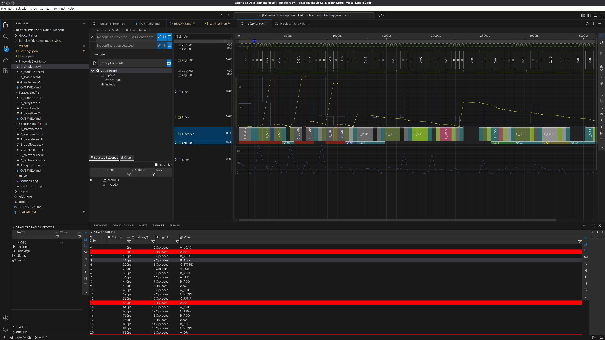

**[1_simple.recMl](1%20records%20%28recMlMz%29/1_simple.recMl)** → View: **simple**
- Signal grouping • Line diagrams (standard/interpolated/annotated) • Gantt with value labels (opcode mnemonics: A_LOAD, B_ADD, C_STORE, etc.) • Custom icons • Multi-axis • Entry-level demonstration

---
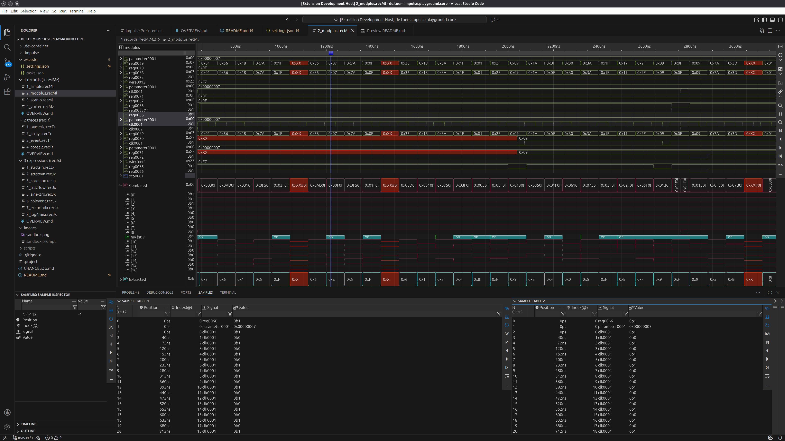

**[2_modplu.recMl](1%20records%20%28recMlMz%29/2_modplu.recMl)** → View: **modplus**
- Deep hierarchy navigation (68 scopes) • Folder organization • Logic combine/extract processors • Signal grouping • Expression filtering with domain ranges (1us-3us) • Combined signals from different scopes

---
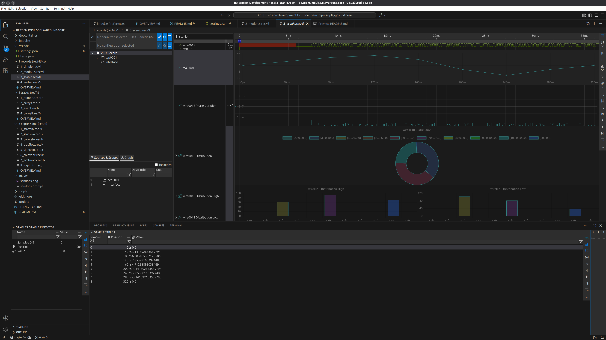

**[3_scanio.recMl](1%20records%20%28recMlMz%29/3_scanio.recMl)** → View: **scanio**
- Phase duration analysis • Distribution binning • High/low separation • Pie/bar charts • Expression-based metrics (wire phase duration)

---
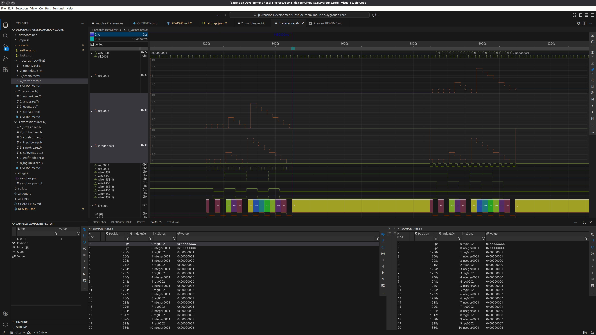

**[4_vortec.recMz](1%20records%20%28recMlMz%29/4_vortec.recMz)** → View: **vortec**
- Large-scale RTL (27k signals) • Logic extraction • Line diagrams with scaling • Expression conversion • Annotation

### 2 traces (recTr)

See: [2 traces (recTr)/OVERVIEW.md](2%20traces%20%28recTr%29/OVERVIEW.md)

Flux SimpleC trace files demonstrating: integers, floats, text, enums/events (Gantt), logic (bit/vector/scattered), arrays, structs. Typical set size: 50k samples..

---
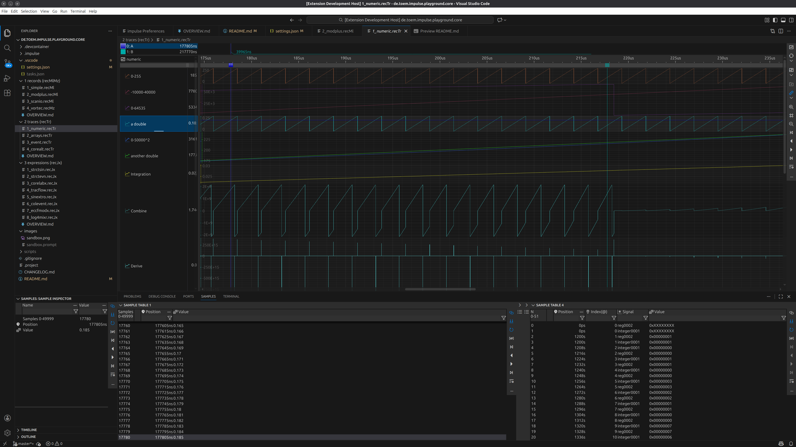

**[1_numeric.recTr](2%20traces%20%28recTr%29/1_numeric.recTr)** → View: **numeric**
- Line plots • Expression processors (integration, derivation, trapezoid) • Float statistics (RMS, energy, std, variance) • Signal combination • Domain-based aggregation • Integer/float signals (0-255, -10k-40k, 0-64k, 0-50k², doubles)

---
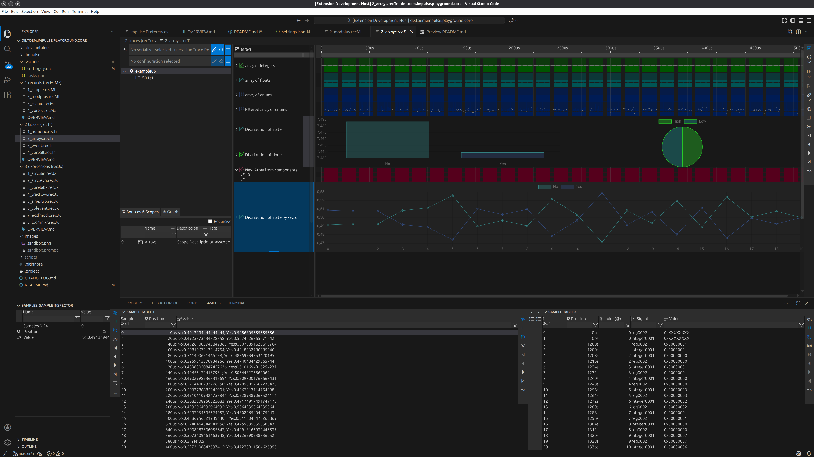

**[2_arrays.recTr](2%20traces%20%28recTr%29/2_arrays.recTr)** → View: **arrays**
- Array member extraction • Array construction from components • Member distribution by sector • Filtered array analysis • State tracking • IntegerArray (2/4 elem), FloatArray (2 elem), EnumArray (8 elem)

---
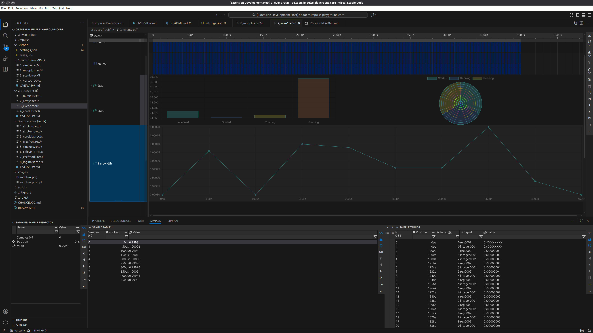

**[3_event.recTr](2%20traces%20%28recTr%29/3_event.recTr)** → View: **event**
- Gantt diagrams • Enum distribution (bar/pie charts) • Event filtering • Bandwidth analysis • Relations visualization • Count statistics • 3 enum types

---
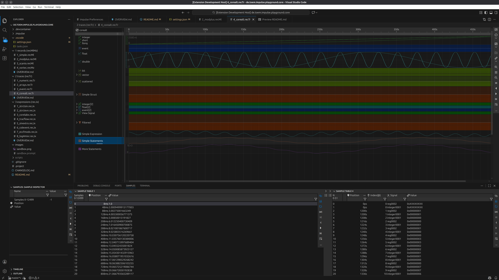

**[4_corealt.recTr](2%20traces%20%28recTr%29/4_corealt.recTr)** → View: **corealt**
- Comprehensive signal types (integers, floats, logic, text, enums, arrays, structs) • Expression filtering • Simple expressions/statements • LZ4 compression

### 3 expressions (recJx)

See: [3 expressions (recJx)/OVERVIEW.md](3%20expressions%20%28recJx%29/OVERVIEW.md)

Expression-based scripts that generate records on the fly: sine/cosine, random waveforms, buses/control, ISR/task Gantt patterns, event relations, structs/arrays, label/color mappings. Time base: ns/ms.

---
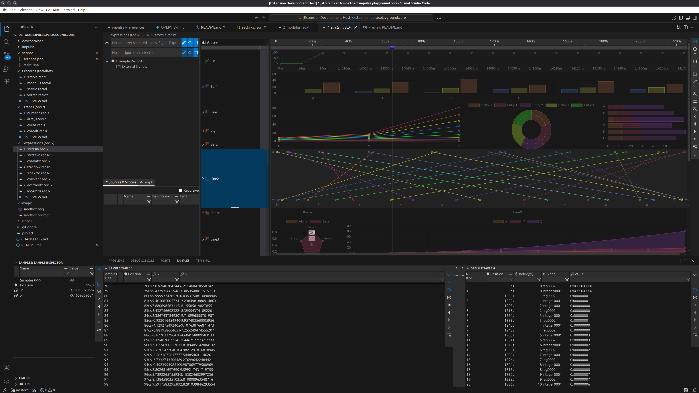

**[1_strctsin.recJx](3%20expressions%20%28recJx%29/1_strctsin.recJx)** → View: **strctsin**
- Bar/line/pie/radar charts • Categorization • Stacked/transposed modes • Fill modes • Expression filtering • XY plotting • Legend/cutout options • Multiple chart types

---
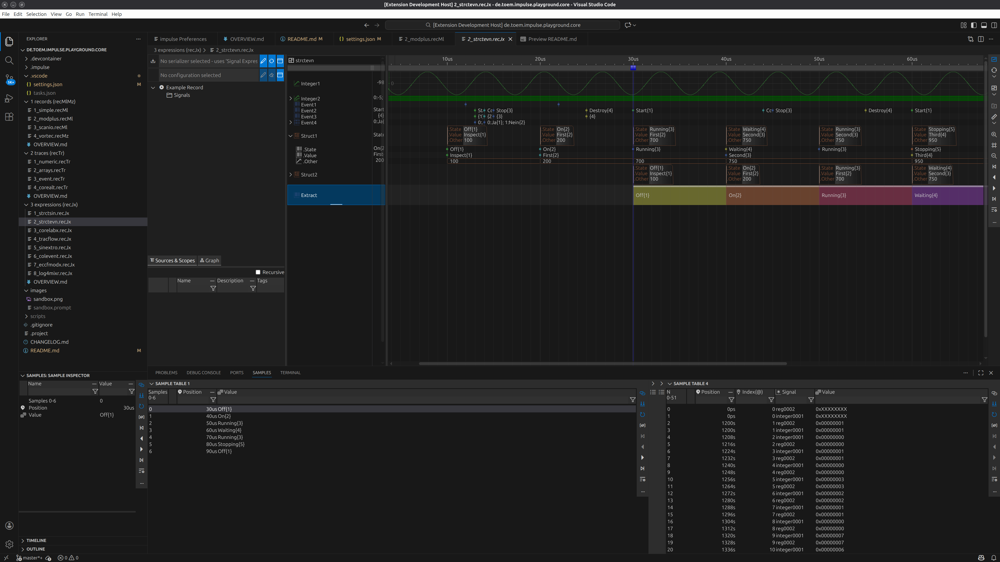

**[2_strctevn.recJx](3%20expressions%20%28recJx%29/2_strctevn.recJx)** → View: **strctevn**
- Struct member extraction • Integer/enum arrays • Event relations • Distribution analysis

---
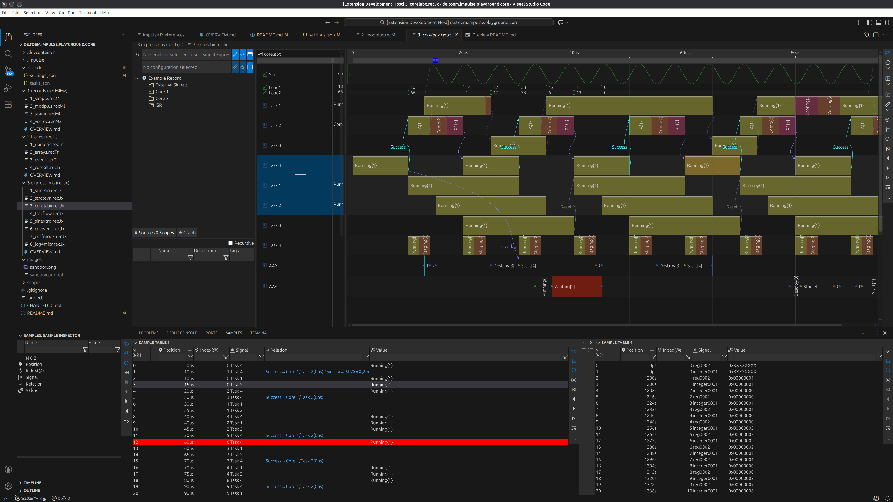

**[3_corelabx.recJx](3%20expressions%20%28recJx%29/3_corelabx.recJx)** → View: **corelabx**
- Dual-core task visualization • ISR tracking • Event relations • Load monitoring • Hierarchical scopes (Core 1/Core 2/ISR)

---
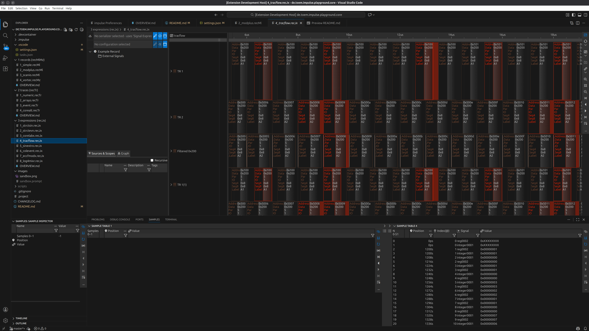

**[4_tracflow.recJx](3%20expressions%20%28recJx%29/4_tracflow.recJx)** → View: **tracflow**
- Transaction flow • Struct filtering (by Data member) • Multiple data members • Sample kind variations (GO_INITIAL/INTER/FINAL)

---
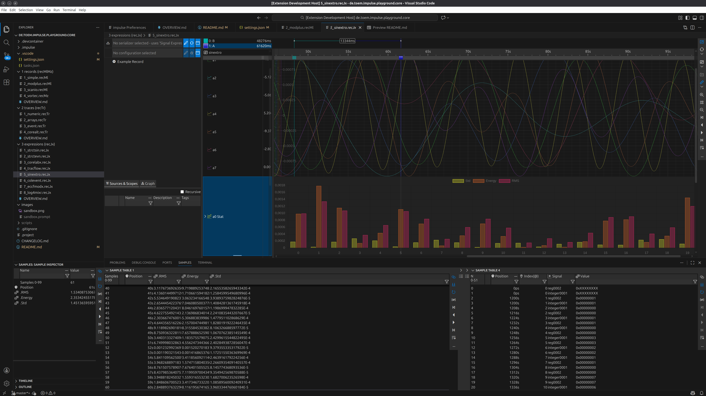

**[5_sinextro.recJx](3%20expressions%20%28recJx%29/5_sinextro.recJx)** → View: **sinextro**
- Multi-channel floats (8 channels) • Interpolation • Annotation • Combine mode • Color assignment • Statistics by sector (RMS/energy/std)

---
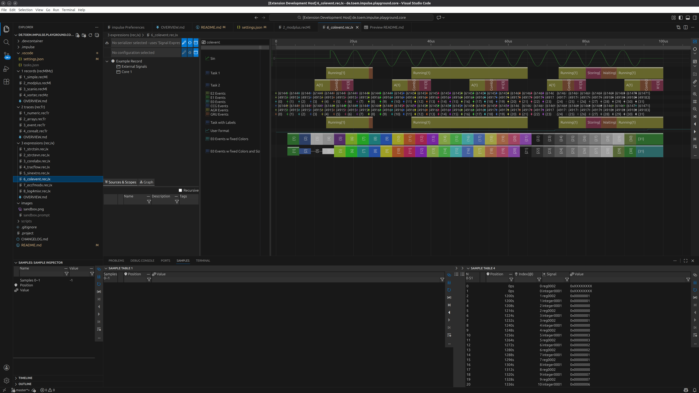

**[6_colevent.recJx](3%20expressions%20%28recJx%29/6_colevent.recJx)** → View: **colevent**
- Task/event coloring • Fixed color mapping • Label formats • Size customization • Color area properties • User formats

---
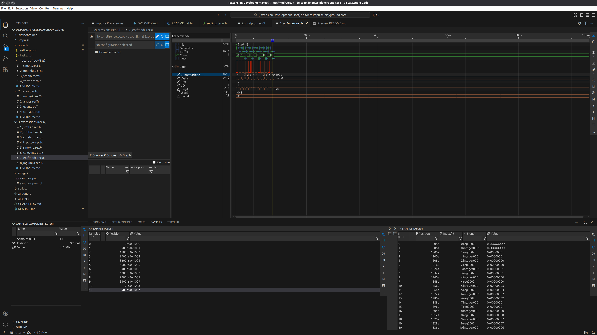

**[7_eccfmodx.recJx](3%20expressions%20%28recJx%29/7_eccfmodx.recJx)** → View: **eccfmodx**
- State machines • Buffer management • Event sequences • Struct logs • Repeated patterns • Relations

---
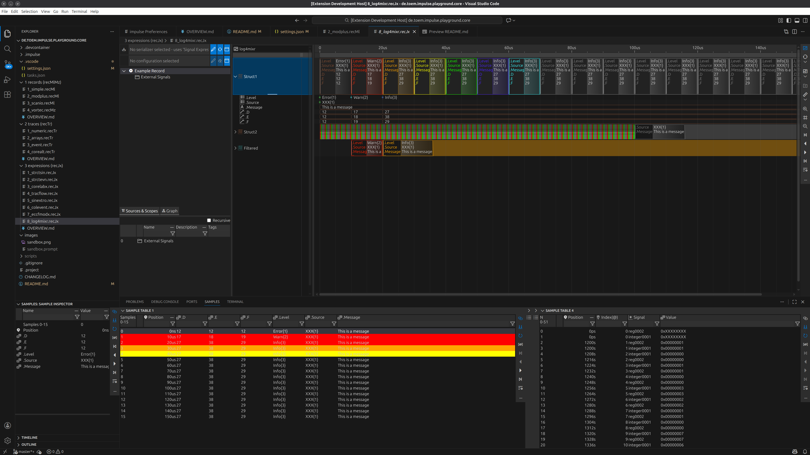

**[8_log4mixr.recJx](3%20expressions%20%28recJx%29/8_log4mixr.recJx)** → View: **log4mixr**
- Log message simulation • Tag filtering (by tag==1 or tag==2) • Enum distribution by member • Struct signals

### 4 values (csv)

See: [4 values (csv)/OVERVIEW.md](4%20values%20%28csv%29/OVERVIEW.md)

CSV data files demonstrating various data acquisition scenarios: CAN bus traces, mathematical functions, analog signal conditioning, and system logs. Flexible format supporting mixed data types and real-world scenarios.

---
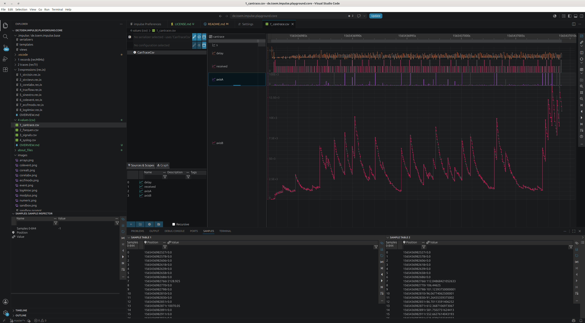

**[1_cantrace.csv](4%20values%20%28csv%29/1_cantrace.csv)** → View: **cantrace**
- CAN bus trace • Timestamp precision (milliseconds) • Communication delay analysis • Multi-axis sensor data • Signal correlation • Real-time visualization

---
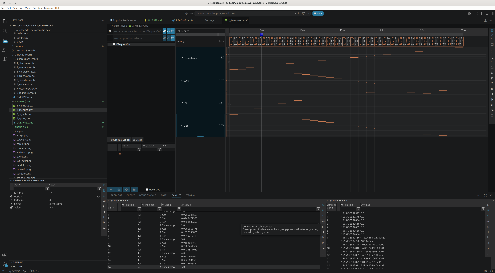

**[2_fsequen.csv](4%20values%20%28csv%29/2_fsequen.csv)** → View: **fsequen**
- Trigonometric functions (sine/cosine/tangent) • Mathematical sequences • Expression evaluation • Function plotting • Range analysis • XY correlation

---
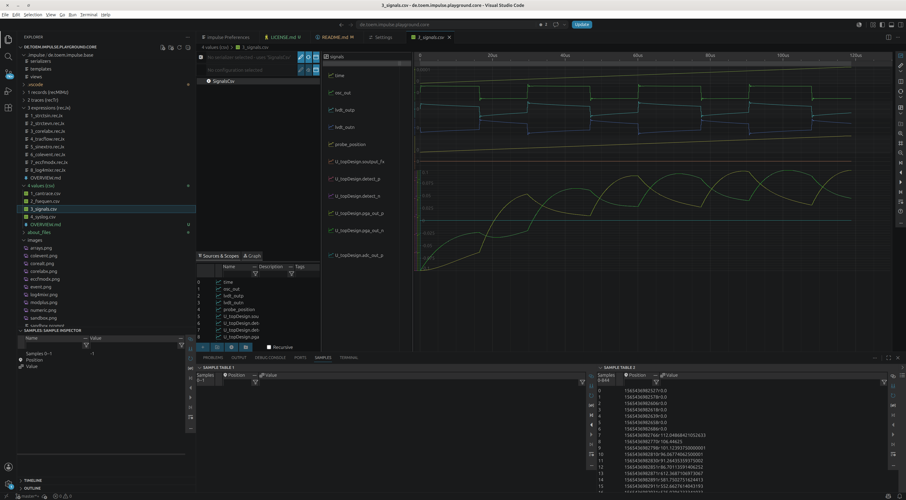

**[3_signals.csv](4%20values%20%28csv%29/3_signals.csv)** → View: **signals**
- Analog signal conditioning pipeline • LVDT measurements • High-precision sampling • Signal processing chain • Multiple derived signals • ADC conversion visualization

---
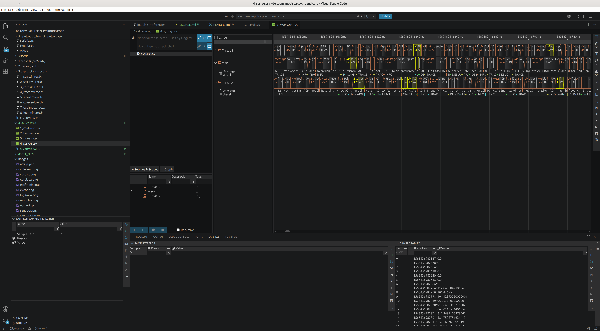

**[4_syslog.csv](4%20values%20%28csv%29/4_syslog.csv)** → View: **syslog**
- Multi-threaded system logs • Log level distribution (TRACE/DEBUG/INFO/WARN/ERROR/FATAL) • Thread tracking • Timestamp correlation • Log filtering • Event extraction

